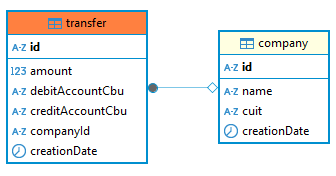

<p align="center">
  <a href="http://nestjs.com/" target="blank"></a>
</p>

[circleci-image]: https://img.shields.io/circleci/build/github/nestjs/nest/master?token=abc123def456
[circleci-url]: https://circleci.com/gh/nestjs/nest

  <p align="center">A progressive <a href="http://nodejs.org" target="_blank">Node.js</a> framework for building efficient and scalable server-side applications.</p>
    <p align="center">
<a href="https://www.npmjs.com/~nestjscore" target="_blank"></a>
<a href="https://www.npmjs.com/~nestjscore" target="_blank"></a>
<a href="https://www.npmjs.com/~nestjscore" target="_blank"></a>
<a href="https://circleci.com/gh/nestjs/nest" target="_blank"></a>
<a href="https://coveralls.io/github/nestjs/nest?branch=master" target="_blank"></a>
<a href="https://discord.gg/G7Qnnhy" target="_blank"></a>
<a href="https://opencollective.com/nest#backer" target="_blank"></a>
<a href="https://opencollective.com/nest#sponsor" target="_blank"></a>
  <a href="https://paypal.me/kamilmysliwiec" target="_blank"></a>
    <a href="https://opencollective.com/nest#sponsor"  target="_blank"></a>
  <a href="https://twitter.com/nestframework" target="_blank"></a>
</p>
  <!--[](https://opencollective.com/nest#backer)
  [](https://opencollective.com/nest#sponsor)-->

## Description

### Implementación de una arquitectura hexagonal en el framework Nest.js con una base de datos mySql.

Se tiene dos entidades:

1. Company: CUIT, Razón Social, Fecha Adhesión

2. Transfer: Importe, Id Company, Cuenta Débito, Cuenta Crédito



## Endpoints

```bash
# Endpoint 1: Trae las empresas que hicieron transferencias el último mes (de hoy hasta los últimos 30 días )
http://localhost:3000/company/transfers
# Endpoint 2: Trae las empresas que se adhirieron el último mes (de hoy hasta los últimos 30 días)
http://localhost:3000/company/company
# Endpoint 3: Permite la adhesión de una empresa
http://localhost:3000/company/
# Documentación en swagger
http://localhost:3000/api
```

## Project setup

```bash
$ npm install
# instala y ejecuta mySql docker container
$ docker compose up -d
# correr en la base el archivo src/script/test-data.sql
```

## Compile and run the project

```bash
# development
$ npm run start

# watch mode
$ npm run start:dev

# production mode
$ npm run start:prod
```

## Run tests

```bash
# unit tests
$ npm run test

# e2e tests
$ npm run test:e2e

# test coverage
$ npm run test:cov
```

## Documentation

```bash
# swagger documentation
http://localhost:3000/api

```
